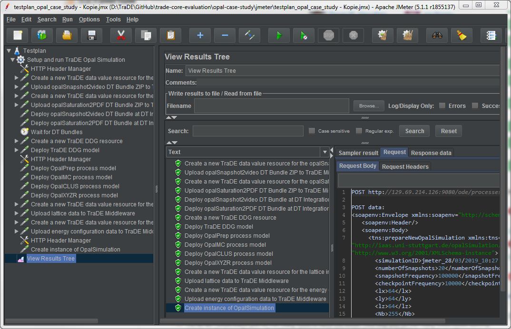

To prepare and setup all required inputs, DT Bundles, process models, etc. within the TraDE environment, we created an Apache JMeter test plan which contains all required steps to automate the whole process.

# Setup Apache JMeter
First you have to download Apache JMeter [here](https://jmeter.apache.org/), unpack and run it.
We successfully executed and tested our test plan with Apache JMeter version 3.2 and the currently latest version 5.1.1.

Help on how to run JMeter is provided in the Get Started section of the User Manual [here](https://jmeter.apache.org/usermanual/get-started.html#running).

# Run the Opal Simulation
* Start JMeter and open the test plan located next to this README.
* (If not done already,) update the user-defined variable "test_vm_ip" (click on "Testplan" entry in the list on the left) and the specify the IP address of the host where the TraDE environment is started using Docker Compose (same as specified in ".env" file for Docker setup). All other variables and data are specified in a self-contained manner and should therefore work as they are.
* Run the test plan by clicking on the corresponding play button located in the middle of the toolbar.
* Click on the "View Results Tree" entry in the list of steps on the left to show the progress of the test plan, i.e., requests send and their responses.
* If successful, all requests should be marked with a green check icon and you can inspect all the different aspects by visiting the WEB UIs of the different components of the TraDE environment (see list below).

Hint: Based on your local Docker setup, i.e., set of already available Docker images, the two DT Bundle deployment steps ("Deploy opalSnapshot2video DT Bundle at DT Integration Middleware" and "Deploy opalSaturation2PDF DT Bundle at DT Integration Middleware") might take up to 10 min (or even longer) since required Docker images have to be pulled and new ones have to be created based on the requirements specified in the API specifications of the DT Bundles.

# Links to WEB UIs to inspect Opal simulation progress and results
* All created data values (and related resources) can be inspected, downloaded or even previewed through the TraDE WEB UI: http://[HOST-IP]:80
* All process instances forming an overall instance of the Opal choreography model and their data can be inspected through the Apache ODE Web UI: http://[HOST-IP]:9080/ode